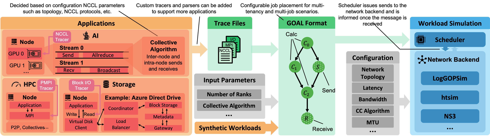

<div align="center">


ATLAHS Simulator Toolchain
===================
An Application-centric Network Simulator Toolchain for AI, HPC, and Distributed Storage

<div align="left">


## Warning
This repository is still under active development. The code is not yet stable, and the documentation is not yet finalized.
It is highly recommended to start using the toolchain after the paper is published, and when the documentation is mostly complete.

## Overview


This repository contains the source code for ATLAHS, a network simulator toolchain for AI, HPC, and storage applications. It contains the following components, detailed documentation of which can be found in their corresponding directories:
- Applications (`apps/`): A collection of applications that are used to test the toolchain.
- GOAL (Group Operation Assembly Language) generators (`goal_gen/`): Tools that trace AI, HPC, and storage applications and converts them into network workloads usable by network simulators.
- Simulation backends (`backends/`): Various backends for simulating network workloads, including LogGOPSim, HTSim, and NS-3 (in progress).


The paper of this work is available on arXiv: [https://arxiv.org/pdf/2505.08936](https://arxiv.org/pdf/2505.08936), and it has been accepted by The International Conference for High Performance Computing, Networking, Storage and Analysis (SC25).

Along with the source code, we also release all the traces (raw files and converted GOAL traces) used in the paper as the [ATLAHS Trace Collection](http://storage2.spcl.ethz.ch/traces/). Not only does it cover a wide range of AI and HPC applications, it is still growing, and we want to encourage the community to contribute more traces to the collection.

## Docker Environment
To facilitate the reproducibility of the results which we publish in the paper, we provide a Docker image that contains all the dependencies that are required to run the ATLAHS toolchain.

To build the Docker image, run the following command:

```bash
docker build -t atlahs .
```

To compile the components required to reproduce the results in
the paper, run:
```bash
docker run --user $(id -u):$(id -g) -v $(pwd):/workspace atlahs build -r
```
This mounts the project directory to `/workspace` inside the con-
tainer and invokes the build.py script in the scripts directory.


### Running a quick test
To run a quick test, run the following command:
```bash
docker run --user $(id -u):$(id -g) -v $(pwd):/workspace atlahs run -q
```
This fetches a small subset of the ATLAHS traces from the SPCL storage server,
and tests the functionality of the ATLAHS toolchain. It converts the raw traces of
AI (nsys-reports) and HPC (PMPI traces) applications into the [GOAL format](https://ieeexplore.ieee.org/document/5362477),
and simulates the workloads with different backends (e.g., LogGOPSim, htsim) in ATLAHS.